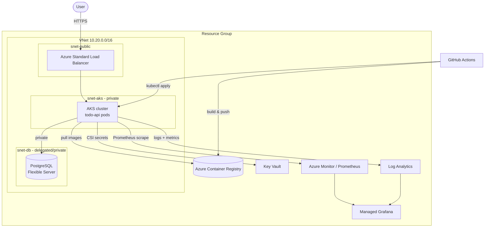

# Platform Engineering Blueprint (Azure)

End-to-end reference implementation of a production-shaped platform on
**Microsoft Azure**. It provisions cloud infrastructure with Terraform, ships a
containerized sample application to **AKS** via GitHub Actions, and wires up
full monitoring, logging, alerting, secret management and backups.

> Built on Azure. A reference **AWS → Azure service mapping** is included in
> [docs/ARCHITECTURE.md](docs/ARCHITECTURE.md) for teams coming from AWS.

---

## What's inside

| Area | Delivered |
| --- | --- |
| **Infrastructure (Terraform)** | VNet + public/private/db subnets, AKS, Azure Database for PostgreSQL Flexible Server, NSGs, Standard Load Balancer, `variables.tf`, remote state, outputs |
| **Deployment automation (CI/CD)** | GitHub Actions: PR tests, image build & push to ACR on merge, staging deploy, **manual approval** for prod, unit + integration tests, dependency + container scanning, Slack notifications |
| **Monitoring & logging** | Container Insights (infra), Managed Prometheus (app RED metrics), DB metrics, centralized logs, **2 Grafana dashboards**, alerts |
| **Documentation & best practices** | This README + `docs/`, **Key Vault secret management**, PostgreSQL **backup strategy** |

## Architecture



Detailed design and decisions: [docs/ARCHITECTURE.md](docs/ARCHITECTURE.md).

## Repository layout

```
platform-engineering-blueprint/
├── app/                  # Sample Node.js/Express todo API (+ tests, Dockerfile)
├── terraform/            # Azure infrastructure as code
│   ├── modules/          # network, aks, database, acr, keyvault, monitoring
│   ├── environments/     # staging.tfvars, prod.tfvars
│   └── bootstrap/        # one-time remote-state storage account
├── k8s/                  # Kustomize base + staging/prod overlays
├── monitoring/           # Grafana dashboards + Prometheus alert rules
├── .github/              # CI, CD and Terraform workflows + composite action
└── docs/                 # Architecture, approach, security, cost, runbook, challenges
```

---

## Prerequisites

- [Azure CLI](https://learn.microsoft.com/cli/azure/) (`az login`)
- [Terraform](https://developer.hashicorp.com/terraform/downloads) >= 1.6
- [kubectl](https://kubernetes.io/docs/tasks/tools/) + [kustomize](https://kustomize.io/)
- [Docker](https://www.docker.com/) and Node.js 20 (for local app work)
- An Azure subscription with rights to create the resources above

## 1) Run the app locally

```bash
cd app
cp .env.example .env
npm ci
# start Postgres + app together:
docker compose up --build        # from repo root
# app: http://localhost:3000  (todo UI + /health, /ready, /metrics)
```

Run the tests:

```bash
cd app
npm test              # unit tests (db mocked)
npm run test:integration   # needs a Postgres on localhost:5432
```

## 2) Provision infrastructure

```bash
# a) One-time: create the remote-state storage account
cd terraform/bootstrap
terraform init && terraform apply
# note the outputs (resource group, storage account name)

# b) Initialize the main config against that backend
cd ..
terraform init \
  -backend-config="resource_group_name=rg-tfstate" \
  -backend-config="storage_account_name=sttfstate<unique>" \
  -backend-config="container_name=tfstate" \
  -backend-config="key=platform/staging.tfstate"

# c) Plan & apply an environment
terraform plan  -var-file=environments/staging.tfvars
terraform apply -var-file=environments/staging.tfvars
```

Key outputs (`terraform output`): `aks_cluster_name`, `acr_login_server`,
`postgres_fqdn`, `key_vault_name`, `workload_identity_client_id`,
`grafana_endpoint`.

## 3) Deploy the application

CI/CD does this automatically (see below). To deploy manually:

```bash
az aks get-credentials -g <rg> -n <aks_cluster_name>
# substitute the overlay placeholders (__PGHOST__, __WORKLOAD_CLIENT_ID__, ...)
# with the Terraform outputs, then:
kubectl apply -k k8s/overlays/staging
kubectl -n app get svc todo-api   # EXTERNAL-IP = load balancer address
```

---

## CI/CD

Three workflows under [`.github/workflows`](.github/workflows):

- **ci.yml** (on PR) — ESLint, unit tests, integration tests against a Postgres
  service container, `terraform fmt/validate`, `npm audit` + Trivy filesystem
  scan, Docker build + hadolint + Trivy image scan, Slack notify on failure.
- **cd.yml** (on merge to `main`) — build & push image to ACR, Trivy gate on
  CRITICAL, deploy to **staging**, then deploy to **production** guarded by a
  GitHub Environment **required-reviewer approval** (the manual approval step).
- **terraform.yml** — `plan` on PRs touching `terraform/`, gated `apply` via
  manual dispatch.

Authentication to Azure uses **OIDC federated credentials** (no long-lived
secrets). Required GitHub configuration is listed in
[docs/RUNBOOK.md](docs/RUNBOOK.md#cicd-configuration).

## Monitoring & logging

- Infra metrics via Container Insights; app RED metrics via managed Prometheus.
- Two Grafana dashboards + Prometheus/metric alerts routed to email + Slack.
- Centralized app/system/access logs in Log Analytics (KQL samples included).

Details: [monitoring/README.md](monitoring/README.md).

## Security & cost

- **Secret management:** Azure Key Vault + Secrets Store CSI driver + workload
  identity — no secrets in code or images. See [docs/SECURITY.md](docs/SECURITY.md).
- **Backup strategy:** PostgreSQL automated backups (7–30 day PITR) + optional
  geo-redundant backups in prod; versioned Terraform state. See
  [docs/SECURITY.md](docs/SECURITY.md#backup-strategy).
- **Cost optimization:** burstable staging SKUs, autoscaling, log retention
  tiers, single vs. geo-redundant per environment. See
  [docs/COST_OPTIMIZATION.md](docs/COST_OPTIMIZATION.md).

## Documentation

- [docs/ARCHITECTURE.md](docs/ARCHITECTURE.md) — design & decisions
- [docs/APPROACH.md](docs/APPROACH.md) — design approach & rationale
- [docs/CHALLENGES.md](docs/CHALLENGES.md) — challenges & resolutions
- [docs/SECURITY.md](docs/SECURITY.md) — security, secrets, backups
- [docs/COST_OPTIMIZATION.md](docs/COST_OPTIMIZATION.md) — cost measures
- [docs/RUNBOOK.md](docs/RUNBOOK.md) — operational runbook & CI/CD setup

## Teardown

```bash
cd terraform
terraform destroy -var-file=environments/staging.tfvars
```

> **Note:** this is a reference/demonstration system. The application logic is
> intentionally minimal so the focus stays on the platform, automation and
> operability around it.
