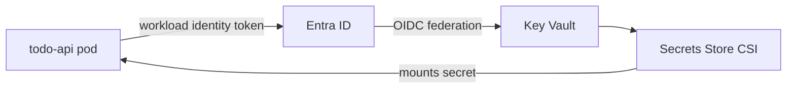

# Security & Best Practices

## Secret management (Azure Key Vault)

- The PostgreSQL admin password is **generated by Terraform** (`random_password`)
  and stored only in **Key Vault** and encrypted state — never in code.
- Key Vault uses **RBAC authorization** (not legacy access policies). The
  Terraform deployer gets `Key Vault Administrator`; the workload identity gets
  `Key Vault Secrets User` (least privilege, read-only).
- Pods read secrets through the **Secrets Store CSI driver** using **workload
  identity** (federated to the AKS OIDC issuer). No secret material is baked into
  images, ConfigMaps, or environment values committed to Git.
- Production enables Key Vault **purge protection** and soft-delete.



## Network security

- Private AKS node subnet; PostgreSQL has **no public endpoint** (VNet-integrated
  + private DNS).
- **NSGs** enforce tiering: internet → 80/443 only on the public subnet; DB 5432
  reachable only from the AKS subnet; explicit deny-all inbound on private tiers.
- **Calico network policy** available for pod-level segmentation.
- TLS enforced in transit to PostgreSQL (`require_secure_transport=ON`,
  `sslmode=require`).

## Workload hardening

- Containers run **non-root**, `allowPrivilegeEscalation: false`,
  `readOnlyRootFilesystem: true`, all Linux capabilities dropped,
  `seccompProfile: RuntimeDefault`.
- Resource **requests/limits** set; **HPA** + **PDB** for resilience.
- ACR **admin user disabled**; nodes pull images via the kubelet **managed
  identity** granted `AcrPull` (no registry passwords).

## Supply-chain security

- **Dependency scanning**: `npm audit` + Trivy filesystem scan on every PR.
- **Container scanning**: hadolint (Dockerfile) + Trivy image scan on PR;
  CD **gates on CRITICAL** vulnerabilities before deploying.
- Results uploaded as **SARIF** to GitHub code scanning.
- Pinned base images and multi-stage builds to minimize the attack surface.

## CI/CD security

- GitHub → Azure auth via **OIDC federated credentials** — no stored cloud
  secrets. Only the Slack webhook is a repository secret.
- Production deploys require a **GitHub Environment approval** (required
  reviewers), providing a manual gate and audit trail.

## Backup strategy

- **PostgreSQL Flexible Server** automated backups with **point-in-time
  restore**: 7-day retention in staging, **30-day** in production.
- Production enables **geo-redundant backups** and **zone-redundant HA**.
- **Terraform state** stored in a GRS storage account with **blob versioning**
  and a 30-day soft-delete retention policy.
- ACR (Premium in prod) supports **geo-replication** for image durability.

### Restore procedure (summary)

```bash
# Point-in-time restore to a new server
az postgres flexible-server restore \
  --resource-group <rg> \
  --name psql-<project>-<env>-restored \
  --source-server psql-<project>-<env> \
  --restore-time "2026-08-29T10:00:00Z"
```

Full runbook: [RUNBOOK.md](RUNBOOK.md).

## Least-privilege summary

| Identity | Grant | Scope |
| --- | --- | --- |
| AKS kubelet identity | `AcrPull` | ACR |
| App workload identity | `Key Vault Secrets User` | Key Vault |
| Grafana managed identity | `Monitoring Data Reader` | Azure Monitor workspace |
| CI/CD (OIDC) | contributor (scoped in practice) | subscription/RG |
